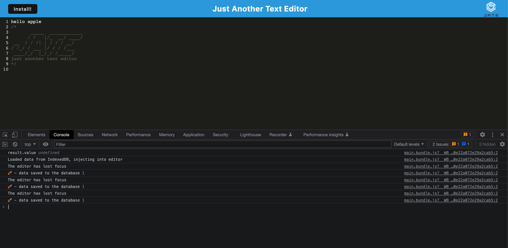

# text-editor-pwa

# Description:

This application makes it easy for users to create notes while allowing users to save and view notes when they feel like it.

# Installation:

User will need to install express in order to run this application.
In the terminal do npm i express @4.17.1 and it will downloaded the version needed.
User will also need to use webpack package. So make sure do npm i.
Remember to clear the cache once on the site and refresh the page. 

# User Story:

AS A developer
I WANT to create notes or code snippets with or without an internet connection
SO THAT I can reliably retrieve them for later use

# Github link:

https://github.com/cguzman37/text-editor-pwa

# Heroku link:

https://salty-anchorage-95276.herokuapp.com/

# Acknowledgements:

The starter code was provided by our teacher assissant. I also worked in a study group with multiple students.